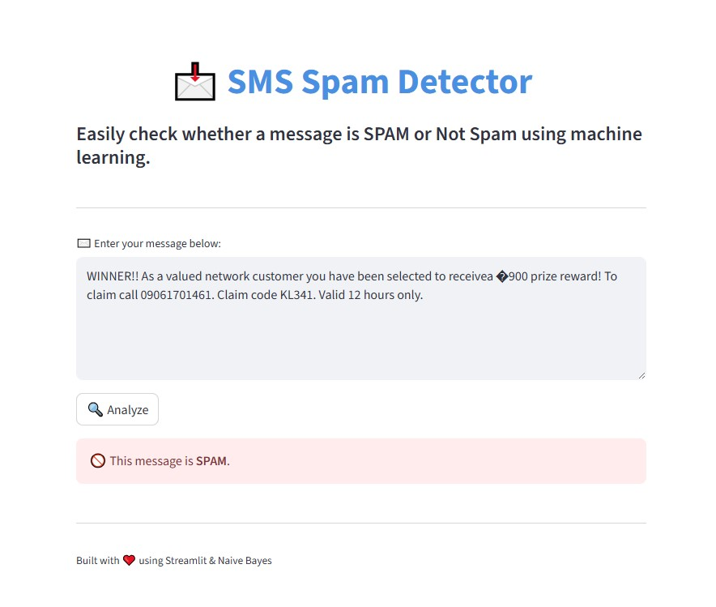

# 📩 SMS Spam Detector using Streamlit

This app classifies SMS messages as **spam** or **ham** using a Naive Bayes classifier.

## 🚀 Features

- Trained with `CountVectorizer` and `MultinomialNB`
- Accuracy: ~98.2%
- Simple, user-friendly UI

## 🛠️ Setup Instructions

1. Clone the repository
2. Install dependencies:

```bash
pip install -r requirements.txt
```

